# ☕ AI Mood Journal

An AI-powered mood tracking iOS application featuring Google Gemini AI integration, voice journaling, and personalized wellness recommendations. Track your emotions, gain insights, and improve your mental well-being.

<p align="center">
  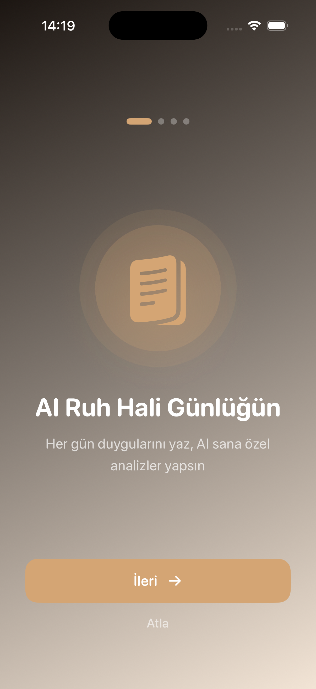
  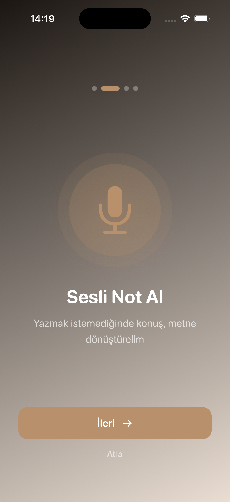
  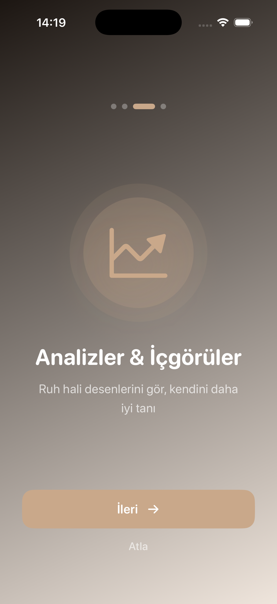
  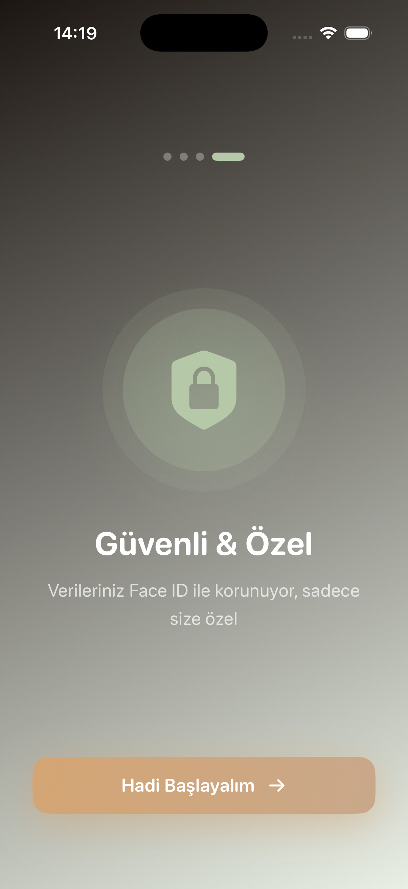
</p>

## ✨ Features

### 📔 Daily Journaling
Write your daily thoughts and feelings. The app maintains one entry per day - write freely and update anytime.

### 🎤 Voice Recording
Turkish speech recognition with real-time transcription. Just speak, and your words become text instantly.

### 🤖 AI Mood Analysis
Powered by Google Gemini AI. Automatically detects your mood (Happy, Calm, Sad, Anxious, Energetic, Peaceful, Excited), analyzes energy levels, sentiment, extracts keywords, and provides personalized summaries.

### 💭 Smart Suggestions
Get personalized activity recommendations, wellness tips, self-care suggestions, and mindfulness techniques based on your current mood and energy levels.

### 📊 Statistics & Analytics
Beautiful visualizations of your mood trends with monthly, weekly, and yearly views. Track emotion distribution, most used keywords, average energy and sentiment scores, and maintain your journaling streak.

### 📅 Calendar View
Monthly calendar layout with daily mood indicators. Easily browse and review your past journal entries.

### 🔐 Security & Privacy
Your data is protected with Face ID or Touch ID biometric authentication. All journal entries are stored securely on your device with Core Data encryption.

### 🔔 Smart Reminders
Customizable notification times with motivational quotes. Choose from daily, weekdays, or weekend reminders to maintain your journaling habit.

##  More Screenshots

### Journaling & AI Analysis
<p align="center">
  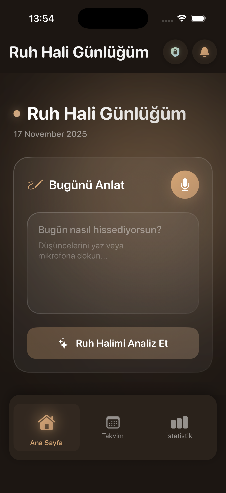
  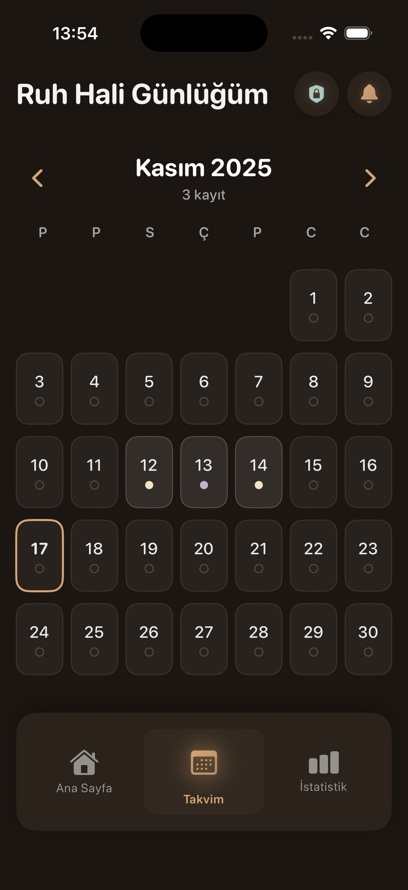
  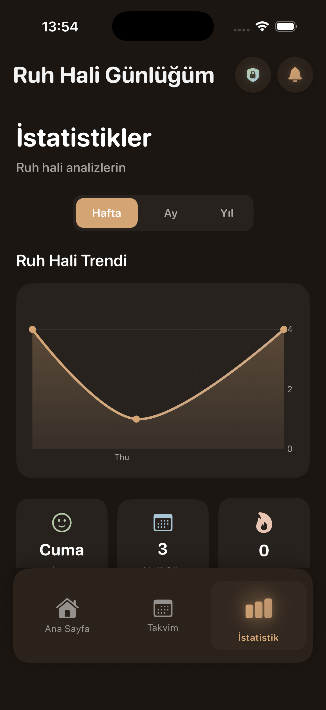
</p>

### Statistics & Calendar
<p align="center">
  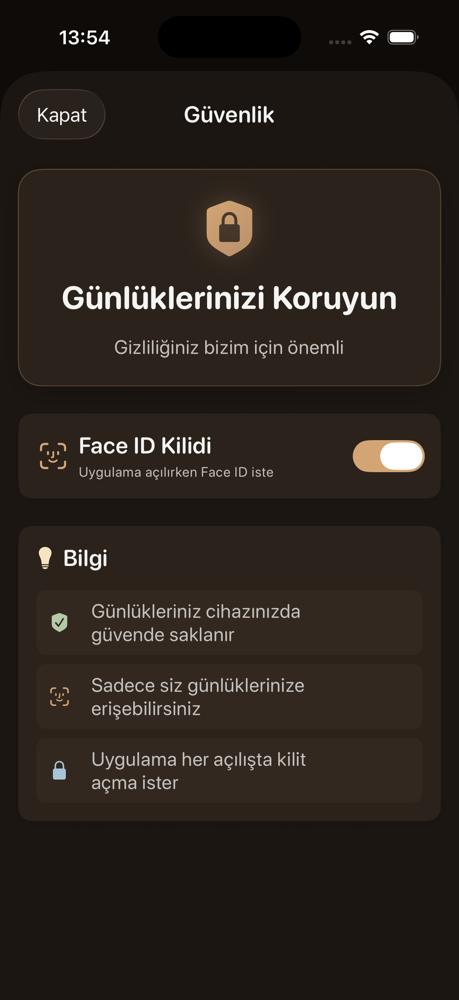
  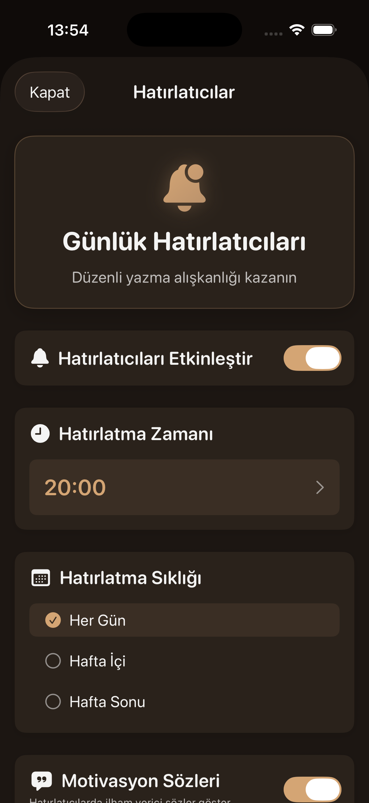
  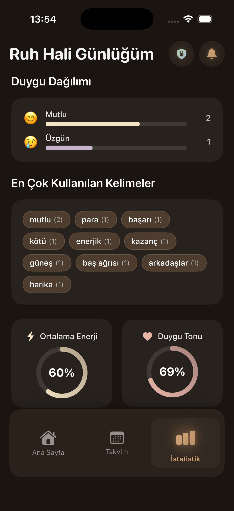
</p>

### Settings & Security
<p align="center">
  
  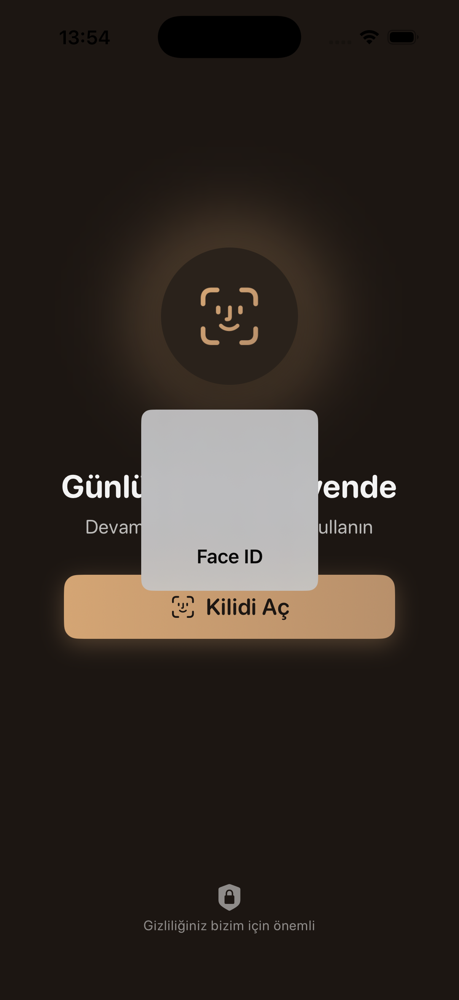
</p>

## 🛠️ Tech Stack

**SwiftUI** - Modern, declarative UI framework  
**Core Data** - Local data persistence  
**Google Gemini API** - AI-powered mood analysis  
**Speech Framework** - Turkish speech recognition  
**LocalAuthentication** - Face ID/Touch ID security  
**UserNotifications** - Smart reminder system  
**Swift Charts** - Interactive statistics  
**Combine** - Reactive programming  

## 📋 Requirements

- iOS 17.0+
- Xcode 15.0+
- Swift 5.9+
- Google Gemini API Key

##  Installation

### Clone the Repository
```bash
git clone https://github.com/humeyragumus/AIMoodJournal.git
cd AIMoodJournal
```

### Create Config File
Create `Core/Config.swift` in the project:
```swift
import Foundation

struct Config {
    static let geminiAPIKey = "YOUR_GEMINI_API_KEY_HERE"
}
```

⚠️ **Important:** The `Config.swift` file is in `.gitignore` for security. You must create your own API key.

### Get Your API Key
1. Visit [Google AI Studio](https://aistudio.google.com/app/apikey)
2. Sign in with your Google account
3. Click "Create API Key"
4. Copy and paste into `Config.swift`

### Run the App
```bash
open AIMoodJournal.xcodeproj
```

Select simulator or device and press Run ▶️

## 🎨 Design Features

**☕ Glassmorphism** - Modern glass-effect cards with beautiful depth  
**☕ Warm Color Palette** - Custom dark brown theme with coffee tones  
**☕ Smooth Animations** - Fluid transitions and delightful interactions  
**☕ Custom Components** - Carefully crafted UI elements  
**☕ Responsive Layout** - Perfect on all iPhone sizes  

## 🌟 Highlights

**One Entry Per Day** - Maintain healthy journaling discipline  
**Contextual AI** - Understands emotions and provides insights  
**Visual Trends** - Track your emotional journey over time  
**Privacy First** - All data stays on your device  
**Beautiful Experience** - Carefully designed for mindfulness  
**Turkish Support** - Full Turkish language integration  

## 🔐 Privacy & Security

- API keys never uploaded to GitHub
- All journal data stored locally
- Biometric authentication available
- Core Data encryption enabled
- No cloud sync (your privacy guaranteed)

## 🐛 Known Issues

Currently no critical issues


##  Acknowledgments

**Google Gemini AI** - Powerful AI analysis capabilities  
**Apple** - Amazing development tools and frameworks  
**SwiftUI Community** - Inspiration and continuous support  
**SF Symbols** - Beautiful icon library  


**Built with ☕ and 🤎 using SwiftUI**
